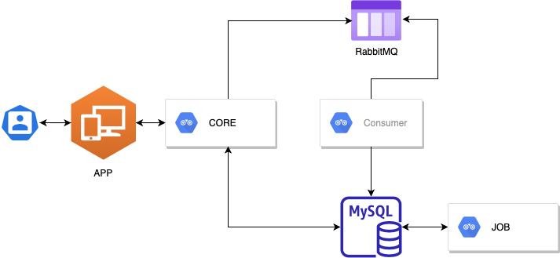

# Trabalho Integration & Development Tools

- Turma 40SCJ
- Professor: Carlos Hesketh

#### Grupo

- Guilherme Mauricio - RM: 340879
- Douglas Mateus - RM: 342031
- João Rafael - RM: 342038
- Julia Assunção - RM: 341934

#### Definição

Este documento tem como objetivo descrever os requisitos para a elaboração de um projeto usado como avaliação da disciplina.

#### Video
https://user-images.githubusercontent.com/7011282/144442236-7fa1f17e-bd69-4835-adde-4613dea37a3d.mp4


### Diagrama



#### Especificações

##### Backend - JAVA

- Java 11
- Spring Framework
- Spring Data
- SpringFox
- Lombok
- Flyway
- MySQL 8
- Gradle
- Docker

##### Frontend - React

- ReactJS
- React-redux
- Redux-saga
- Axios
- Styled-components
- Reactotron

#### Requisitos

- Docker

#### Como executar o projeto:

\*\* O terminal deve estar na pasta raiz do projeto

1. Executar o comando para fazer o build e aguardar a execução:

   ```
      docker-compose build
   ```

2. Depois de executado o comando anterior, executar o seguinte:

   ```
      docker-compose up -d
   ```

#### Link

**Swagger:** http://localhost:11080

O projeto irá executar na porta 8080 (http://localhost:8080)
